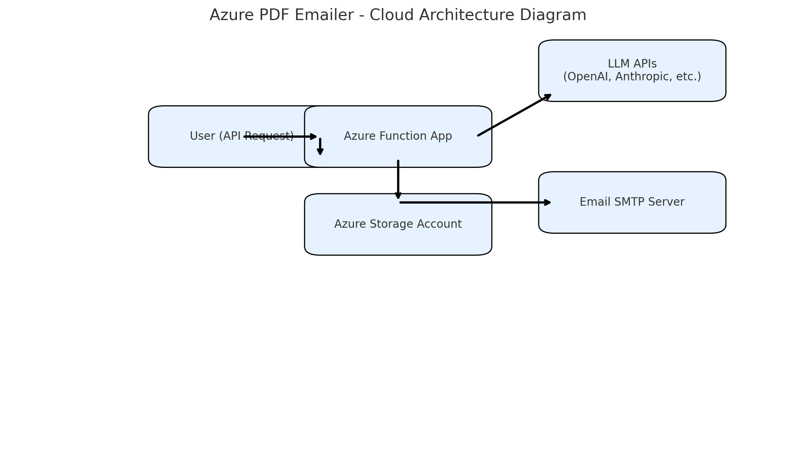

### ✅ Azure PDF Emailer - Architecture Diagram

This visual shows the flow:
1. User makes an API request to the Azure Function.
2. Function invokes an LLM API (e.g., OpenAI) to generate content.
3. Content is saved or transformed (optional) via Azure Storage.
4. The function uses SMTP to email the newsletter.

---

### 💰 Comprehensive Cost Analysis

| Resource                 | Azure Service Tier            | Estimated Cost (Monthly) | Notes                                                                 |
|--------------------------|-------------------------------|---------------------------|-----------------------------------------------------------------------|
| Azure Function App       | Consumption Plan              | ~$0 (first 1M executions) | Pay-per-execution; free for most light use.                          |
| App Service Plan         | Basic (B1)                    | ~$13.39                   | Used if not running consumption. Optional for more control.          |
| Azure Storage Account    | Standard LRS (5 GB)           | ~$0.10                    | Used for PDF backups or logs.                                        |
| Application Insights     | Basic (5 GB/month)            | ~$0 (then $2.30/GB)       | Optional monitoring.                                                 |
| Outbound Email (SMTP)    | Gmail (via App Password)      | Free                      | Usage subject to provider rate limits.                               |
| OpenAI API Key           | gpt-3.5-turbo (pay-per-token) | ~$0.002 / 1K tokens       | One email costs ~1500 tokens ≈ $0.003                                |

---

### 🔁 Breakdown Example

| Scenario                              | Monthly Emails | OpenAI API Cost | Azure Function Cost | Total Estimated |
|---------------------------------------|----------------|------------------|----------------------|------------------|
| Small creator testing (dev mode)      | 100            | $0.30            | $0                   | $0.30            |
| Weekly newsletter (1K subscribers)    | 4,000          | $12              | $0.50                | $12.50           |
| Agency with 10K clients (monthly)     | 10,000         | $30              | $2                   | $32              |